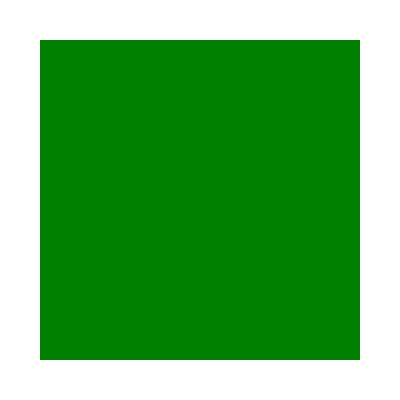

# Renderable empty groups

An SVG group is a container element. It can be used to reference multiple elements at once
via the `use` element, as long as the group has the `id` attribute.
It can be used to propagate common properties to its children.
Or it can be used to visually group a list of elements.

A typical group would look something like this:

```xml
<g fill="green">
    <rect/>
    <rect/>
</g>
```

Here we have two rectangles that would be filled with a green color.

After reading this explanation you might think that a group
without any children is useless. After all, if there are
no children - there is nothing to render. So such a group can _simply_ be skipped.<br>
Well, there is no such thing as _simple_ in SVG.

First, we have to remember that SVG supports filters. For example, a drop shadow.
And filters can be applied to groups as well.<br>
By default, a filter's rendering region is 10% bigger than the element's bounding box it is applied to.
And in the case of an empty group, the bounding box is also "empty", so there is nothing
we can apply the filter to.<br>
But a filter can define its own region in absolute coordinates, in which case
the element's bounding box should be ignored. Yes, even when it's actually zero.

What it all means is that we can easily write something like:

```xml
<filter id="filter1" filterUnits="userSpaceOnUse" x="20" y="20" width="160" height="160">
    <feFlood flood-color="green"/>
</filter>
<g filter="url(#filter1)"/>
```

and it would be rendered as:

<p align="center">

</p>

## A group color

And we're not done yet. Let's say we have a group like this:

```xml
<g fill="green">
    <rect fill="blue"/>
</g>
```

The `fill` property on the group seems to be useless.
After all, the child rectangle would overwrite it anyway. Right?<br>
Well, there is actually a case when this `fill` property is relevant.
And it has to do with filters again.

By default, a filter uses the current element's content as a source image.
But it can be overwritten using not one, not two,
but [seven inputs](https://www.w3.org/TR/SVG11/filters.html#FilterPrimitiveInAttribute).
And two of them are `FillPaint` and `StrokePaint`.

So in the case of:

```xml
<filter id="filter1" filterUnits="userSpaceOnUse" x="20" y="20" width="160" height="160">
    <!-- zero-blur acts as fill background here -->
    <feGaussianBlur stdDeviation="0" in="FillPaint"/>
</filter>
<g filter="url(#filter1)" fill="green"/>
```

Our blur's input bitmap will be filled with `FillPaint`, which is the current `fill` value
of the element the `filter` attribute was set onto.

So in this case, not only the group itself isn't useless, but also the `fill` property.

And yes, you can use a gradient or a pattern input as well. The only problem is that this
case is completely undocumented and each SVG library does whatever it wants.

Just look how [this](https://github.com/RazrFalcon/resvg-test-suite/blob/master/svg/e-filter-037.svg)
file would be rendered. It's just comically bad.


