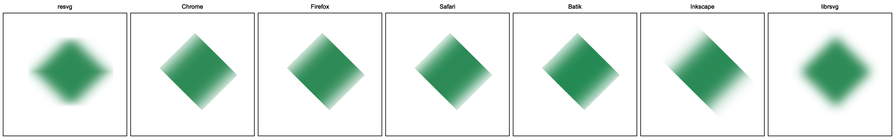
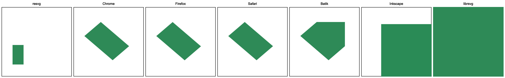
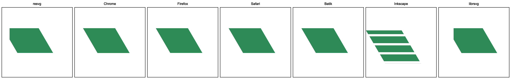
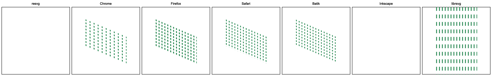
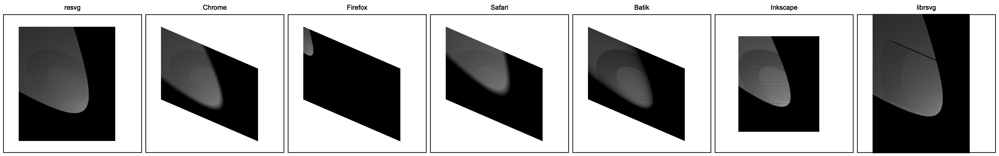

# Filter transform

As with almost every element in SVG, filters can also be transformed.
The problem with filters in particular is that transforming them is actually pretty hard.

For one, this is not documented at all. Which is not that uncommon in SVG.<br>
But also, filters are rendered in a specific way. Unlike most elements in SVG,
filters require a bitmap source as an input. So we have to render our element
onto a new bitmap (its region calculation is a yet another topic),
apply a filter to it, and then render the bitmap back onto our canvas.
And figuring out the right place to apply the transform can be challenging.

I know it sounds ridiculous. After all, affine transformations
are the most basic SVG feature. How can one mess it up?<br>
Well, let the following examples speak for themselves.

How about a rotated rectangle with a `feGaussianBlur`

```xml
<filter id="filter1">
    <feGaussianBlur stdDeviation="12 0"/>
</filter>
<rect x="80" y="10" width="80" height="80" fill="seagreen" filter="url(#filter1)"
      transform="rotate(45 60 60)"/>
```



or a simple `feFlood`

```xml
<filter id="filter1" primitiveUnits="objectBoundingBox" height="0.5">
    <feFlood flood-color="seagreen" width="0.5"/>
</filter>
<rect x="20" y="20" width="80" height="80" filter="url(#filter1)"
      transform="skewX(30) rotate(-30) translate(-80 40) scale(2)"/>
```



or an even simpler `feOffset`

```xml
<filter id="filter1">
    <feOffset dx="20" dy="40"/>
</filter>
<rect x="20" y="20" width="100" height="100" fill="seagreen"
      filter="url(#filter1)" transform="skewX(30) translate(-50)"/>
```



and what about `feTile`

```xml
<filter id="filter1">
    <feFlood flood-color="seagreen" x="28" y="28" width="10" height="10"/>
    <feOffset dx="5" dy="5"/>
    <feTile/>
</filter>
<rect x="40" y="30" width="90" height="75"
      filter="url(#filter1)" transform="skewX(30) rotate(30)"/>
```



And the final piece! The absolute state of SVG - `feDiffuseLighting` + `feSpotLight`

```xml
<radialGradient id="rg1" r="0.5">
    <stop offset="0.5" stop-color="white"/>
    <stop offset="1" stop-color="black" stop-opacity="0"/>
</radialGradient>
<filter id="filter1" color-interpolation-filters="sRGB">
    <feDiffuseLighting>
        <feSpotLight x="140" y="150" z="40" limitingConeAngle="20"/>
    </feDiffuseLighting>
</filter>
<rect x="30" y="20" width="100" height="100"
      fill="url(#rg1)" filter="url(#filter1)" transform="skewX(30) rotate(30)"/>
```



Every single application renders it differently! It's absurd!

<br>

All the results above were done on the latest versions of the mentioned libraries and applications
on Feb 2023.
