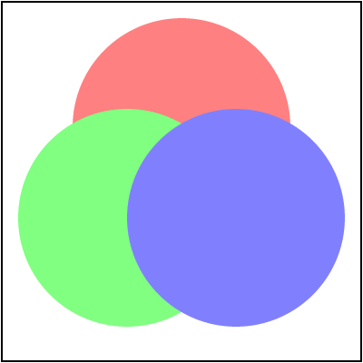
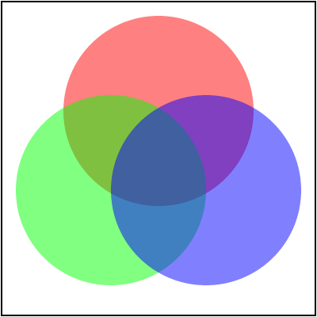

# Isolated groups

Most people are familiar with the concept of layers from image editing applications
like Photoshop. Where each shape, image and text are represented as individual layers
and each of those layers can be arbitrarily grouped.<br>
It's a pretty simple idea. You essentially have a stack of images
that are blended together to produce the final image.<br>
And while SVG's XML structure may look like a tree of layers - it's not.

Not only we do not render each SVG element into a dedicated image/layer -
unless you have a powerful GPU and infinite RAM -
we do not have layers to begin with.<br>
When rendering SVG, we simply render each element directly to the main canvas
without creating individual images/layers. Except for _isolated groups_.

What is an _isolated group_? This is a very good and a very complicated question.<br>
And first we have to understand what is an SVG group.

An SVG group, aka a `<g/>` element, is technically just a syntax sugar.
It allows us to visually group elements and/or propagate common properties.
Meaning that:

```xml
<g fill="green">
    <rect/>
    <rect/>
</g>
```

is semantically identical to:

```xml
<rect fill="green"/>
<rect fill="green"/>
```

And for our renderer such a group is [no-op](https://en.wikipedia.org/wiki/NOP_(code)).
We could skip it and simply render its children.

On the other hand, clipping, masking, filters and opacity can be set only on groups.
Yes, an ability to set the `opacity` attribute on other elements is just a syntax sugar as well.
Meaning that:

```xml
<rect opacity="0.5"/>
```

is technically:

```xml
<g opacity="0.5">
    <rect/>
</g>
```

And this time our renderer would create a temporary image, will draw a rectangle on it
and then blend that image to the main canvas.

A group that requires an image allocation is called _isolated_.
It can be defined indirectly, by setting non-default
`clip-path`, `mask`, `filter` and/or `opacity` attributes.
Or directly, since SVG 2, by setting `style="isolation:isolate"`.

How bad can it be? Let's try to render a group with three circles and opacity:

```xml
<g opacity="0.5">
    <circle id="circle1" cx="100" cy="70" r="50" fill="#f00"/>
    <circle id="circle2" cx="70" cy="110" r="50" fill="#0f0"/>
    <circle id="circle3" cx="130" cy="110" r="50" fill="#00f"/>
</g>
```

<p align="center">

</p>

If we ignore the group isolation and simply apply opacity to each circle we would get:

<p align="center">

</p>

Funnily enough, this is exactly what QtSVG does. It doesn't support isolation.
Probably for performance reasons.

<br>

You can find more details in the [spec](https://www.w3.org/TR/SVG2/render.html).
