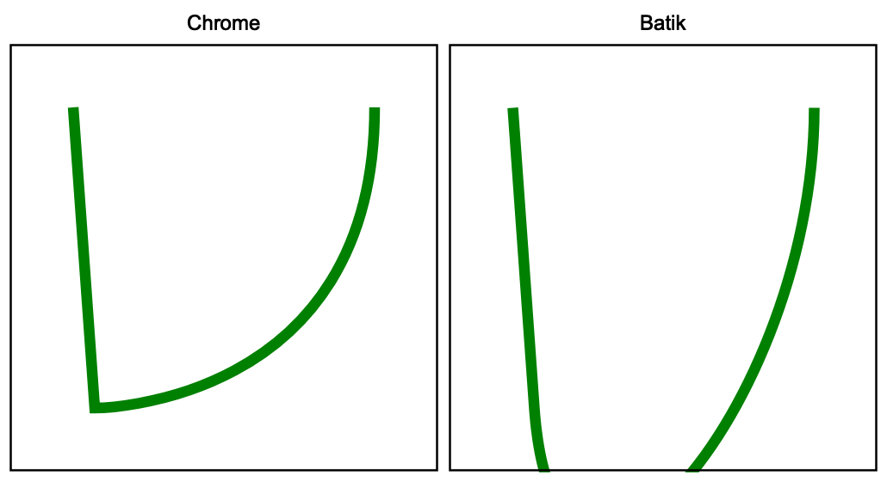
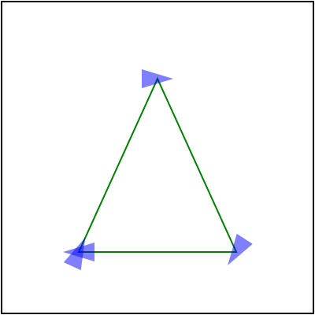
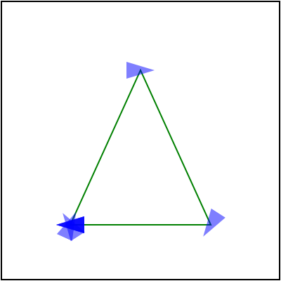
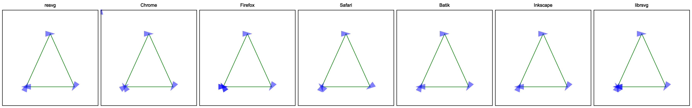
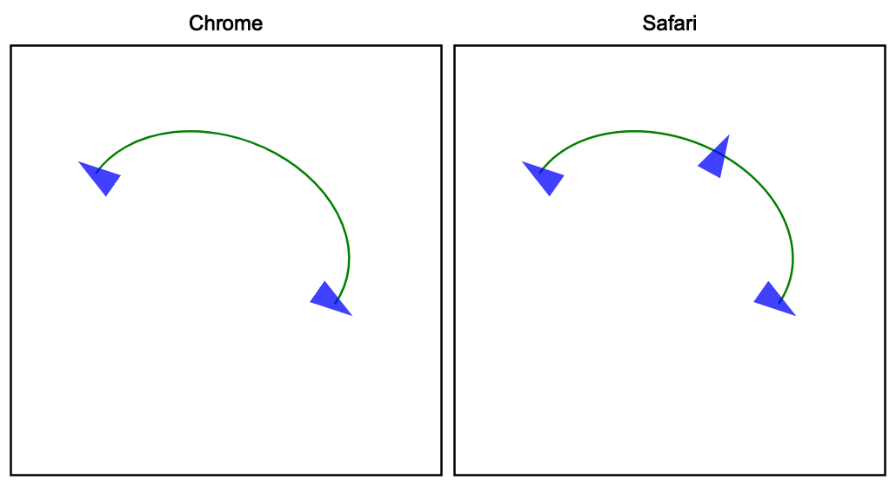

# Path data

[SVG path data](https://www.w3.org/TR/SVG2/paths.html#PathData),
aka the `d` attribute in the `path` element, deserves its own book. This is how complicated it is.

Sure, in most cases you will see something like `M 100 100 L 200 200` and it doesn't look
that bad. But `M10-20A5.5.3-4 110-.1` is a perfectly valid SVG path as well.
How is it possible? Let's find out!

## Basics

While the [SVG path data](https://www.w3.org/TR/SVG2/paths.html#PathData) section of the spec
details everything nicely, here are some basic terminology:

- _command_ - upper or lower case M, L, H, V, C, S, Q, T, A and Z character
- _coordinate_ - a number, usually a pair
- _segment_ - a pair of a (potentially implicit) _command_ and _coordinates_
- _subpath_ - a list of _segments_ starting from MoveTo and ending with ClosePath, a new MoveTo
  or the end of the data
- _path_ - a list of _subpaths_

## Parsing steps

Path data parsing can be split into two steps: parsing/tokenization of the original segments
(absolute, relative, implicit, shorthands)
and simplification of them to leave only the basic segments (move, line, curve, close)
in absolute coordinates.

The _simplification_ step is important, since SVG path data notation is far more complex
then a typical 2D library API would allow. That's what this chapter about.

## Implicit sequential commands

If a path has multiple sequential segments of the same type, like:

```
M 10 20 H 10 H 20 H 30 V 40
```

SVG allows us to specify the command only the first time, like:

```
M 10 20 H 10 20 30 V 40
```

## Implicit sequential MoveTo commands

If we take the idea above and apply it to MoveTo (`M`) segments it _will not_ produce
the output you expect.

In SVG, the following path will produce nothing since a single subpath must have
at least two segments. And here we have two subpaths with a single segment.
And no, this is not two [zero-length subpaths](./zero-length-paths.md).

```
M 10 20 M 30 40
```

<br>

But the following path will produce a line. Why?!
Because an implicit command after MoveTo is treated as LineTo and not MoveTo. Yeah...

```
M 10 20 30 40
```

Is the same as:

```
M 10 20 L 30 40
```

<br>

And we're not done yet. The implicit LineTo command is affected by MoveTo's absolute/relative state.
Meaning that:

```
m 10 20 30 40
```

is

```
m 10 20 l 30 40
```

and not

```
m 10 20 L 30 40
```

## Implicit MoveTo segment after ClosePath

And we're not done with MoveTo yet. If you read the spec extremely carefully,
you will notice the following line:

> If a "closepath" is followed immediately by any other command,
  then the next subpath starts at the same initial point as the current subpath.

Which means that:

```
M 10 20 L 30 40 Z L 50 60
```

is identical to:

```
M 10 20 L 30 40 Z M 10 20 L 50 60
```

and it's not an error.

<br>

What is interesting is that path data _must_ start with a MoveTo segment.
Meaning that the following path is invalid:

```
L 30 40
```

and _must not_ be treated as

```
M 0 0 L 30 40
```

or something like that.

And surprise-surprise, some libraries do that. Specifically Batik and QtSvg.

## Relative MoveTo segment after ClosePath

A relative MoveTo segment after ClosePath is relative to the previous MoveTo segment
since ClosePath moved the current coordinate to it.

It might not look like that big of a problem, but depending of how you're parsing the path data
you might use the previous MoveTo coordinate directly, which is incorrect.
The previous _absolute_ MoveTo coordinate must be used.

Meaning that in the case of:

```
M 10 20 L 30 40
m 50 60 L 70 80 Z
m 90 100 L 110 120
```

the second MoveTo is relative to the current position, i.e. 30,40 + 50,60.
And the third MoveTo is relative to the _absolute_ second MoveTo, i.e. 30,40 + 50,60 + 90,100

## ArcTo flags

The [ArcTo](https://www.w3.org/TR/SVG2/paths.html#PathDataEllipticalArcCommands) segment has
a pretty straight-forward syntax:
```
rx ry x-axis-rotation large-arc-flag sweep-flag x y
```

But if you read the EBNF grammar very carefully you will notice that
`large-arc-flag` and `sweep-flag` do not require a space after them.

```
elliptical_arc_argument::=
    number comma_wsp? number comma_wsp? number comma_wsp
    flag comma_wsp? flag comma_wsp? coordinate_pair

flag::=("0"|"1")
```

After all, they can be set to either 0 or 1, so we already know their length.
Therefore:

```
A 5 5 30 1 1 10 20
```

is identical to:

```
A 5 5 30 1110 20
```

<br>

Until recently, QtSvg did not supported it. And Batik would even crash in some cases.

## Curve shorthands

Quadratic and cubic curve segments allow a shorthand variant, in which case one
of the coordinates can be skipped if it can be resolved from the previous segment.

In the case of CurveTo shorthand (`S`):

> The first control point is assumed to be the reflection of the second control
  point on the previous command relative to the current point.

Which basically means:

```
x1 = prev_x * 2 - prev_x2
y1 = prev_y * 2 - prev_y2
```

This way

```
M 10 20 C 30 40 50 60 70 80 S 90 100 110 120
```

becomes:

```
M 10 20 C 30 40 50 60 70 80 C 90 100 90 100 110 120
```

because:

```
70 * 2 - 50 = 90
80 * 2 - 60 = 100
```

<br>

And a subcase of this is:

> If there is no previous command or if the previous command
  was not an C, c, S or s, assume the first control point is
  coincident with the current point.

This way

```
M 10 20 S 30 40 50 60
```

becomes

```
M 10 20 C 10 20 30 40 50 60
```

<br>

QuadraticTo shorthands work similarly to CurveTo shorthands,
but instead of reflecting the x2/y2, they reflect x1/y1 one.

<br>

Note that during the simplification stage, the "previous segment" refers
to the last simplified one and not the previous one in the original path data.
Otherwise, when we have a mix of different curve shorthands we would get invalid results.

Which is what Batik does in the case of:

```
M 30 30 T 40 170 S 170 170 170 30
```

which should be resolved to:

```
M 30 30 Q 30 30 40 170 C 40 170 170 170 170 30
```

while Batik produces this:

<p align="center">

</p>

This is a good illustration that even the most basic features, like path data,
cannot be used in a reproducible way. Inevitably there will be a library or an app that would
fail due to complexity.

## Trailing data

During parsing, any malformed data should simply end parsing of the current path data.
So in case of something like `M 10 20 L 30 40 abcdef` a proper parser should
return `M 10 20 L 30 40` and maybe print a warning. A parser should not ignore the already parsed
data. It should not skip elements with malformed path data.
Neither it should abort parsing of the whole document.

This may sound like an obvious behavior, but Batik 1.16 will abort the file parsing completely
and throw an error. And Inkscape 1.2 will ignore the whole path.

## Duplicated ClosePath segments

To close a subpath, SVG uses the ClosePath (`Z`) segment.
Stroking of:

```
M 0 50 L 50 0 L 100 50
```
will produce two lines. But

```M 0 50 L 50 0 L 100 50 Z```

will produce a triangle.

<br>

And no one stops you from having as many repeated ClosePath segment as you want.
But only one _must_ remain. So:

```
M 0 50 L 50 0 L 100 50 Z Z Z Z Z Z
```

should simplifying just to:

```
M 0 50 L 50 0 L 100 50 Z

```

By the spec, consecutive ClosePaths are no-op. Meaning `Z Z Z Z` is the same as `Z`.
The important part here is that removal of duplicated ClosePaths should be done before
markers resolving. The `marker-mid` property should be applied to each segment.
And if you still have multiple ClosePaths you may end up with something like this:

|Correct|Incorrect|
|---|---|
|  |  |

And while markers in general are poorly supported, this case trips even browsers:



Here, only resvg, Batik and Inkscape are correct.

## ArcTo to CurveTos

Most 2D libraries do not provide an API to append SVG Arcs to a path.
Some 2D libraries do have `arc_to` methods, but SVG arcs are a bit special.
Therefore most SVG parsers would convert Arcs to Curves themselves.

And since it's on this list - you know it's bad. In fact, it's a surprisingly hard task.
And of course, the SVG spec doesn't define it in any way.

To make things worse, there are multiple ways you can do this and each of them
would take 200-300 lines of code.

<!-- TODO: find a code sample somewhere -->

## Markers on ArcTo

Continuing the previous section, ArcTo to CurvesTo conversion hides another issue.
Usually, a single ArcTo would be converted into multiple CurveTos. Getting just one is pretty rare.
Which means the number of segments in our path has changed.
Why does it matter? Because of `marker-mid`.

`marker-mid` attribute allows us to draw a marker at each segment end
(yes, confusing, I know, but this is what _mid_ means in this context.
`marker-end` means the end of the path, not a segment).
And if the number of segments has changed, we could get something like this:

<p align="center">

</p>

resvg and Safari would fail to render this correctly. I personally still have no idea how to preserve
the original segment ends. Since it would require to resolve markers before paths simplification.
Which doesn't make any sense.

<!-- TODO: numbers parsing section -->
