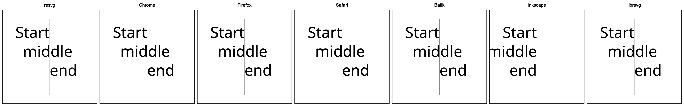
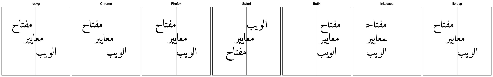
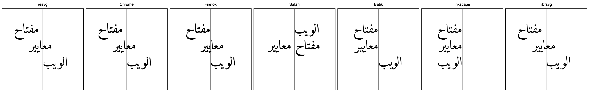
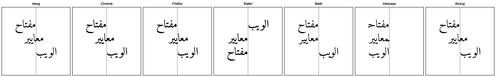
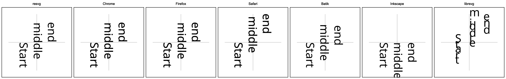

# `text-anchor`

SVG allows text alignment using the `text-anchor` property.
It supports three pretty common states:
start (left), middle (center) and end (right).
As always, it might look like a simple property, but it is not.

The first issue is that `text-anchor` aligns a text chunk and not the whole text
and not a span. You can find more info about it
in the [Text chunks](./chunks.md) chapter.

The second issue is that its behavior somewhat defined only for horizontal,
left-to-right layouts.
Right-to-left and vertical layouts are completely undefined.
How bad can it be? Well, let's start with something simple.

```xml
<text x="100" y="60" text-anchor="end">
    Start<tspan x="100" y="100" text-anchor="middle">middle</tspan>
    <tspan x="100" y="140" text-anchor="start">end</tspan>
</text>
```



Inkscape already out.

<br>

What about Arabic text?

```xml
<text>
    <tspan x="100" y="60" text-anchor="end">مفتاح</tspan>
    <tspan x="100" y="100" text-anchor="middle">معايير</tspan>
    <tspan x="100" y="140" text-anchor="start">الويب</tspan>
</text>
```



Hm... Not good. Technically, our overlord Chrome is correct here.
Firefox is close, but has a slightly incorrect placement.
Safari, Batik and Inkscape are completely wrong.

<br>

Now let's make our text a bit more complex, but logically the same.

```xml
<text x="100" y="60" text-anchor="end">
    مفتاح
    <tspan x="100" y="100" text-anchor="middle">معايير</tspan>
    <tspan x="100" y="140" text-anchor="start">الويب</tspan>
</text>
```

Now our first chunk doesn't have a dedicated `tspan`, but logically it's identical to the one above.



And immediately, our seemingly trivial change lead to a different output.

<br>

Somehow, even by removing a new line from the first text node we can change the rendering.

```xml
<text x="100" y="60" text-anchor="end">
    مفتاح<tspan x="100" y="100" text-anchor="middle">معايير</tspan>
    <tspan x="100" y="140" text-anchor="start">الويب</tspan>
</text>
```



Notice that Safari no longer renders two words one the same line now.

Whitespaces handling in SVG is its own circle of hell, which we discuss in
the [Whitespaces handling](./whitespaces.md) chapter. And it can affect even
something seemingly unrelated like RTL text alignment.

<br>

At last, what about the vertical layout? Even with an English text.

```xml
<text y="100" x="60" writing-mode="tb" font-family="Noto Sans" font-size="32">
    Start<tspan y="100" x="100" text-anchor="middle">middle</tspan>
    <tspan y="100" x="140" text-anchor="end">end</tspan>
</text>
```



Yeah... As expected.
