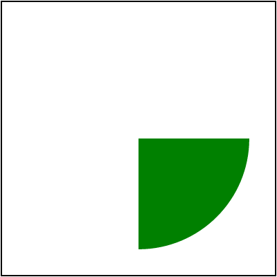

# `use` to `symbol`

The `use` element has three separate [behaviors](https://www.w3.org/TR/SVG11/struct.html#UseElement)
depending on what element it is referencing:
a `svg` element, a `symbol` element or any other graphical element.
In this chapter we would focus on the `symbol` element.

What is `symbol`?
The [SVG 1 definition](https://www.w3.org/TR/SVG11/struct.html#SymbolElement)
of the `symbol` was hilariously bare-bone. It basically only acknowledges that such
an element exists and that's it. This is probably the reason why it's so poorly supported.<br>
The [SVG 2 definition](https://www.w3.org/TR/SVG2/struct.html#SymbolElement)
of the `symbol` is far better but still doesn't really go into nitty-gritty details.
And more importantly, doesn't explain why we need it in the first place.

In simple terms, `symbol` is just an invisible, nested `svg`.<br>
Why does it even exist then? That's a good question and I have no idea.

Unlike nested `svg`, `symbol` cannot be rendered directly, even when it is located outside `defs`.
And it isn't just `display:none`. `symbol` and all its content are invisible by design
and can be rendered only via `use`.
And since `symbol` is just a nested `svg`, it also has its own viewport and must be clipped,
which confuses a lot of people.

Let's say we have an SVG like this:

```xml
<svg viewBox="0 0 200 200">
    <symbol id="symbol1">
        <circle cx="0" cy="0" r="80" fill="green"/>
    </symbol>
    <use xlink:href="#symbol1" transform="translate(100 100)"/>
</svg>
```

A `symbol` with a green circle at 0,0 rendered with a 100,100 offset.
You would probably imagine to see a circle in the center of the image.<br>
Wrong!

<p align="center">

</p>

Wait, why there is only a quarter of the circle visible? Where the rest have gone?

Well, this is `symbol` for you. Remember that just like a nested `svg`, symbol must be clipped.
And by default, the clip region is the same as the current viewport, aka our root `svg` element.

What a rendered would do is that it would create a new canvas with the same size as the parent one.
So 200x200 in our case. Draw `symbol`'s content onto it, clipping everything outside the canvas.
Draw `symbol`'s canvas onto the main canvas using the transform specified on the `use` element.

Since out circle starts at 0,0 - our symbol canvas would have only
the bottom-right quarter of the circle, which then be moved to the center of the main canvas.

In fact, we can losslessly rewrite our SVG above into:

```xml
<svg viewBox="0 0 200 200">
    <clipPath id="clipPath1">
        <rect x="0" y="0" width="200" height="200" fill="black"/>
    </clipPath>
    <g clip-path="url(#clipPath1)" transform="translate(100 100)">
        <circle cx="0" cy="0" r="80" fill="green"/>
    </g>
</svg>
```

<!-- TODO: link nested svg chapter when ready -->
<!-- TODO: explain viewbox and size logic -->

<br>

Also, since `symbol` is just a nested `svg`, it also affected by the
[`use` to `svg` size resolving](./use-to-svg-size-resolving.md) logic.

<br>

Overall, `symbol` is quite useless, unintuitive and poorly supported
(Inkscape 1.2 basically ignores it). I would strongly advise against using it.
