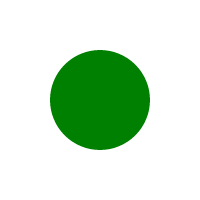

# Zero-length paths

Let's say we have a path `M 50 50 L 50 50`. Its bounding box and length are both zero.
Can it still be rendered? Sort of.

We cannot fill it, because there is no shape to be filled.
And we cannot stroke it, because the length is zero.
But SVG has a special case for this.

If a zero-length path has a stroke with `stroke-linecap` set to `round` or `square`,
then we have to replace it with a circle or a rectangle with a size equal to `stroke-width`
and a center at the path's start.

This means that:

```xml
<path stroke="green" stroke-width="50" stroke-linecap="round" d="M 50 50 L 50 50"/>
```

would be rendered as a circle with a radius 25 at 50,50

<p align="center">

</p>

and

```xml
<path stroke="green" stroke-width="50" stroke-linecap="square" d="M 50 50 L 50 50"/>
```

would be rendered as a 50x50 rectangle at 25,25

<p align="center">

</p>

Note that `M 10 20` is a malformed path not a zero-length one, while `M 10 20 Z` is zero-length.

And while some 2D graphics libraries do support this out of the box, some not.
Which means that an SVG rendering library should check each path for zero-length
subpaths beforehand and replace them with circles and rectangles accordingly.

As of Feb 2023, QtSvg doesn't support this case at all. Inkscape supports only the `round` case.
And `qlmanage` (previews generator) on macOS renders `square` one incorrectly (while Safari is fine).
